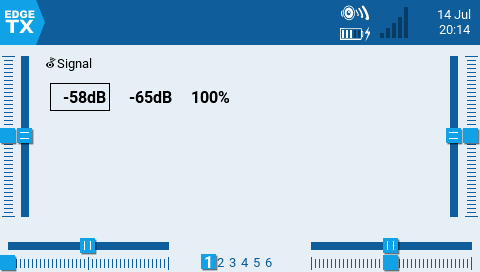

# EdgeTX Lua Scripts

This repository contains various [Lua](https://luadoc.edgetx.org) knick knacks for EdgeTX.

## Autocomp

A simple brake (flaps/spoiler/crow) compensation system inspired by Mike Shellim's [crow aware elevator trim](https://rc-soar.com/edgetx/lua/adaptivetrim/).

1. Name your brake input "Spo".
2. Name your elevator compensation curve "Cmp".
3. Assign the `cmpinc` and `cmpdec` functions to a trimmer via Special Functions.

Now the trimmer will adjust the Y values of the Cmp curve. The point chosen will be the one whose X value is closest to the current Spo value.

## Breadcrumbs

This function script will log the current GPS coordinates to `/LOGS/crumbs.txt`. This is intended for marking positions during search-and-rescue operations.

Entries are appended to the file in DD format along with a timestamp. Nothing will be recorded if there is no active `GPS` telemetry sensor.

## Clear Logs

This tool script will delete all the CSV files from the /LOGS directory. Handy if, like me, you log every flight in case of disaster but never bother looking at most successful flight logs.

## Signal

This is a simple signal health widget for ExpressLRS. It shows the RSSI of each receiver antenna as well as RQly. The RSSI of the currently active antenna is highlighted.

## Talking Timer

These function scripts enable and disable voice callouts for timer one.

* tmr_vc enables voice callouts.
* tmr_qt disables voice callouts.

Intended for use in glider competition, it allows the task timer to be quickly silenced if it is out of sync with the (big, loud) official timer.
